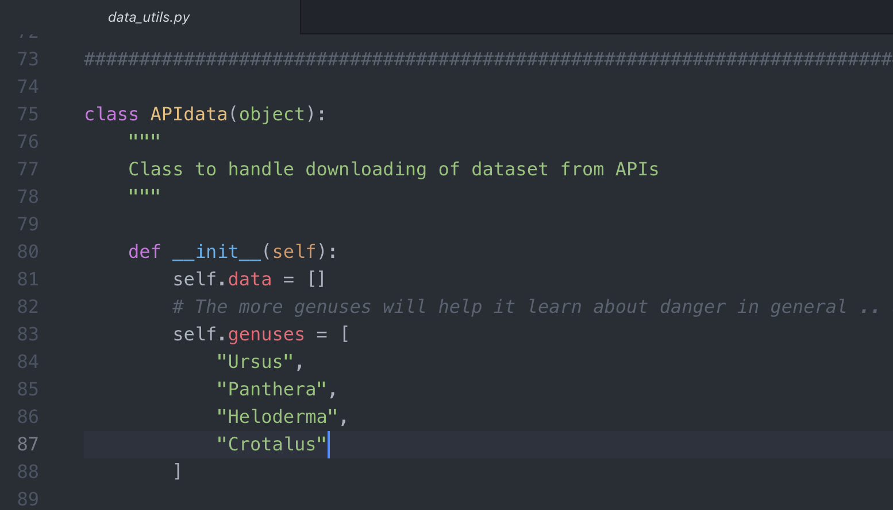
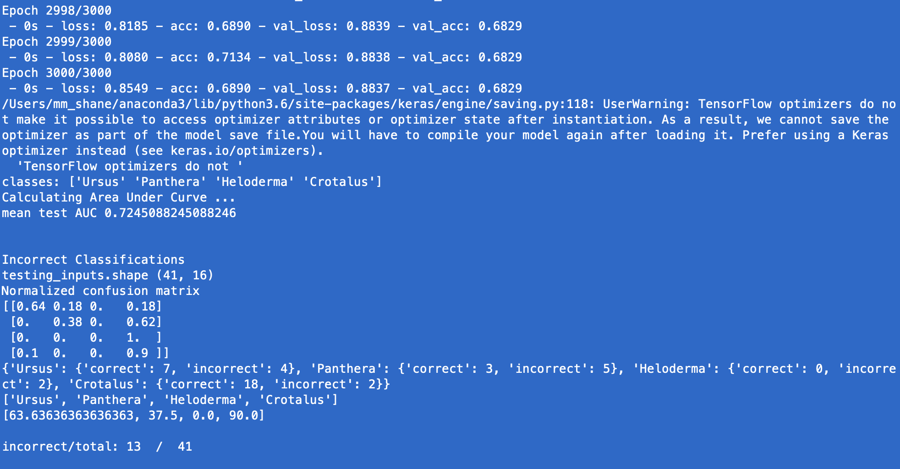
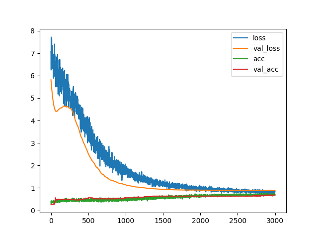
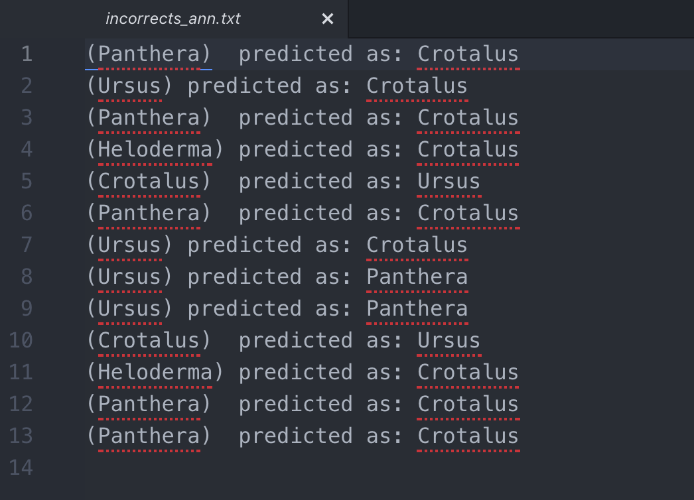
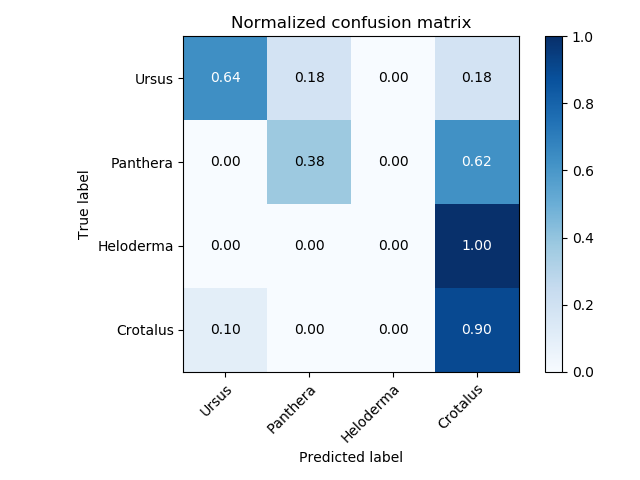

## Danger Predictor -- will a bear, cougar, gilamonster or rattlesnake bite you today?

Predict whether today is the day to run away from danger!

Gather historical weather data of dangerous sightings posted to iNaturalist.

Integrates w/ DarkSky weather API and iNaturalist API.

Get data points like geolocation, date-time, vegetative index, temperature, barometric pressure, past precipitation, precipitation probabilities.

Feed data into machine learning models. Neural networks (regular and convolutional), decision trees, k nearest neighbors algorithms. Choose the best performing model to train.

Run TODAY'S data (weather, geo, etc.) through the trained model to predict your changes of seeing a dangerous animal near you today.

## Setup and Run

#### Create files at project level:

- secret_key1.txt -- just one line w/ WEATHER_KEY from https://darksky.net/dev (credit card required, but won't cost you much.)
- secret_key2.txt -- just one line w/ AGRO_KEY from http://api.agromonitoring.com (*optional* and not working anyways .. but if it was it would say, look out for danger in forested areas, not in parking lots.)

Make logs folder: `mkdir logs`

#### To run:

Imports + training. Imports *cost money* depending on how many weather observations done. But doesn't cost much at all.

`python main.py --imports Y`

Just training w/o imports. I have checked in training data. Trains default model (ann).

`python main.py`  - Trains default model (ann).
`python main.py --model decisiontree` - trains decision tree
`python main.py --model kneighbors` - trains k nearest neighbors model

Keras model file exported to logs folder for use in prediction.

Train using all data available for a production model (otherwise uses TRAINING_SPLIT variable). Use more than default epochs.

`python main.py --useall Y --epochs 3000`

#### For daily predictions using trained models

ANN model

`python predict.py --model ann`

Decision tree model

`python predict.py --model decisiontree`

K-nearest neighbors model

`python predict.py --model kneighbors`

#### Evasion Tactics

Don't run uphill from a bear! Are you kidding me? Bears are top-heavy and are clumsier going downhill. You, as a bipedal, actually have pretty good balance running downhill. But a bear would crush you on an incline.

See: https://youtu.be/38NR2c9i3vM

#### Data for Training

Headers from data/headers.txt

- classnumber - *class number of genus*
- day_of_year - *day of year 1-365*
- lat - *latitude*
- lon - *longitude*
- precipProbability - *precipitation probability on the day of observation*
- precipProbabilityPreviousDay - *precipitation probability on the previous days*
- precipProbabilityPreviousDay2
- precipProbabilityPreviousDay7
- pressure - *barometric pressure*
- temperatureMax - *high temp on day of observation*
- temperatureMaxPrevDay1 - *high temp on day before observation*
- temperatureMaxPrevDay2 - *high temp on two days before observation*
- temperatureMaxPrevDay7
- temperatureMin - *low temp on day of observation*
- temperatureMinPrevDay1 - *low temp on day before observation*
- temperatureMinPrevDay2
- temperatureMinPrevDay7

#### Screenshots
---
Select Genuses in data_utils

---
Import Started! Reports the dangerous locations.

---
Class imbalance eh? Not enough data!

- 1 - Ursus
- 2 - Panthera
- 3 - Heloderma
- 4 - Crotalus

---
3000 epochs (about 5 mins on cpu).

---
Look at it go

---
Dangerously bad guessing model

---
OMG it thinks everything is a rattlesnake!

---
