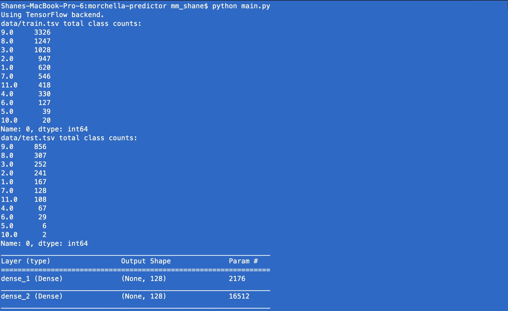
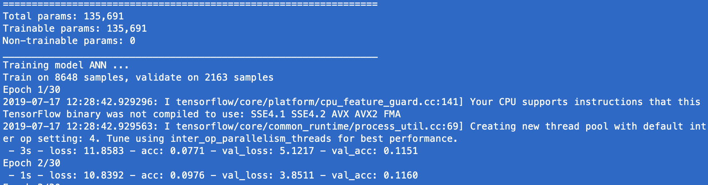
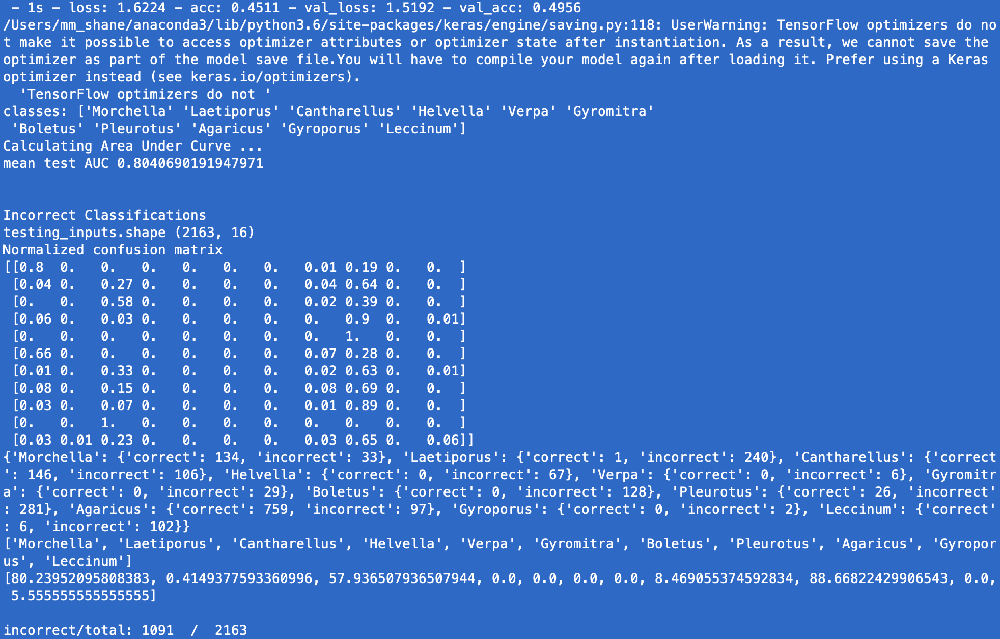
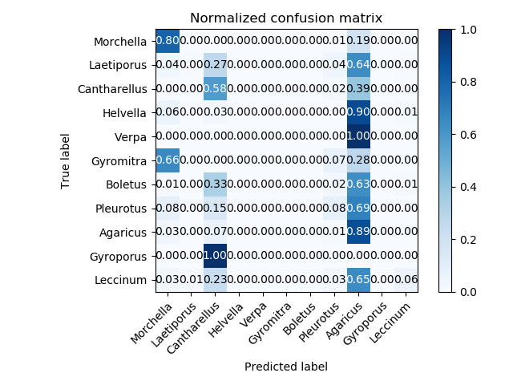
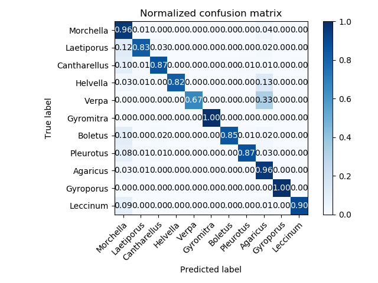
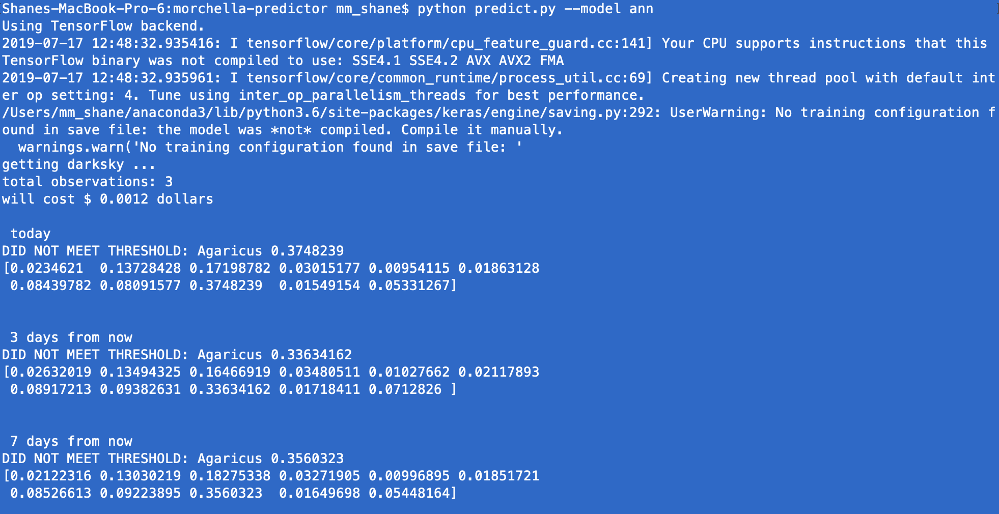
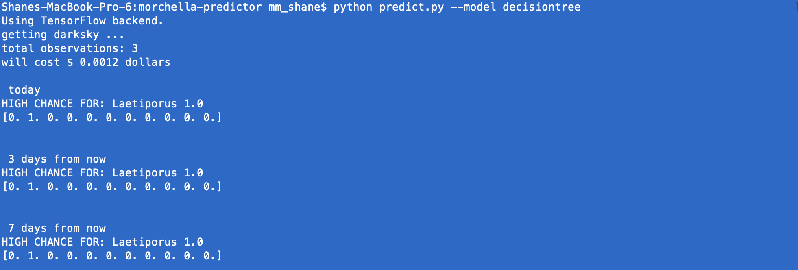
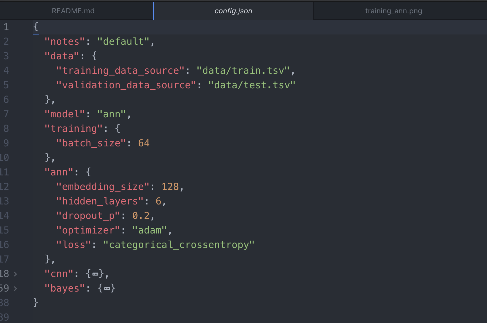

## Morchella (Genus of morel mushroom) & More! Occurrence Prediction App

Predict whether today is the day to go mushroom hunting! (in a more complex way than just picking up a guide). Feed your family! Fresh food, probiotics! Be healthy and local.

Gather historical weather data of mushroom sightings posted to iNaturalist.

Integrates w/ DarkSky weather API and iNaturalist API.

Get data points like geolocation, date-time, vegetative index, temperature, barometric pressure, past precipitation, precipitation probabilities.

Feed data into machine learning models. Neural networks (regular and convolutional), decision trees, k nearest neighbors algorithms. Choose the best performing model to train.

Run TODAY'S data (weather, geo, etc.) through the trained model to predict your chances of seeing which mushroom species!

Current observation genus: Morchella, Laetiporus, Cantharellus, Helvella (false morel), Verpa (false morel), Gyromitra, (false morel), Boletus, Pleurotus, Agaricus, Gyroporus, Leccinum.

Why pick up a guide (or ask an older Russian woman), when you can predict the hunting season with ML.

## Setup and Run

#### Create files at project level:

- secret_key1.txt -- just one line w/ WEATHER_KEY from https://darksky.net/dev (credit card required, but won't cost you much.)
- secret_key2.txt -- just one line w/ AGRO_KEY from http://api.agromonitoring.com (*optional* and not working anyways)

`mkdir logs`

#### To run:

Imports + training. Imports cost money depending on how many weather observations done.

`python main.py --imports Y`

Just training w/o imports. Trains default model (ann).

`python main.py`  - Trains default model (ann).
`python main.py --model decisiontree` - trains decision tree
`python main.py --model kneighbors` - trains k nearest neighbors model

Keras model file exported to logs folder for use in prediction.

Train using all data available for a production model (otherwise uses TRAINING_SPLIT variable). Use more than default epochs.

`python main.py --useall Y --epochs 3000`

#### For daily predictions using trained models

ANN model

`python predict.py --model ann`

Decision tree model

`python predict.py --model decisiontree`

K-nearest neighbors model

`python predict.py --model kneighbors`

#### Mushroom recipes

Batter and Fry.

#### Data for Training

Headers from data/headers.txt

- classnumber - *class number of genus*
- day_of_year - *day of year 1-365*
- lat - *latitude*
- lon - *longitude*
- precipProbability - *precipitation probability on the day of observation*
- precipProbabilityPreviousDay - *precipitation probability on the previous days*
- precipProbabilityPreviousDay2
- precipProbabilityPreviousDay7
- pressure - *barometric pressure*
- temperatureMax - *high temp on day of observation*
- temperatureMaxPrevDay1 - *high temp on day before observation*
- temperatureMaxPrevDay2 - *high temp on two days before observation*
- temperatureMaxPrevDay7
- temperatureMin - *low temp on day of observation*
- temperatureMinPrevDay1 - *low temp on day before observation*
- temperatureMinPrevDay2
- temperatureMinPrevDay7

#### Screenshots
---

Class imbalance eh?

1 - Morchella
2 - Laetiporus
3 - Cantharellus
4 - Helvella
5 - Verpa
6 - Gyromitra
7 - Boletus
8 - Pleurotus
9 - Agaricus
10 - Gyroporus
11 - Leccinum

---

---

---
ANN (needs improvement)

---
Decision Tree (much better!)

---
Predictions! July 17th, 2019.

---

---
Configs!

---
